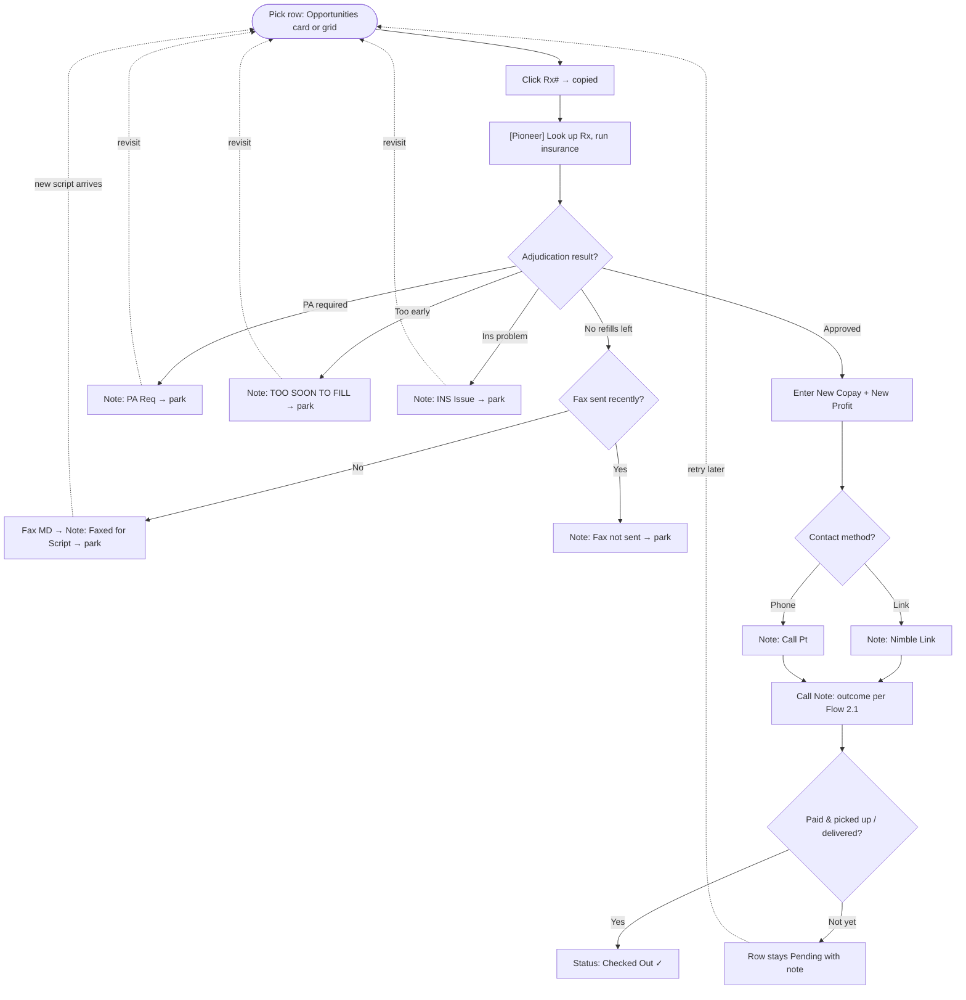
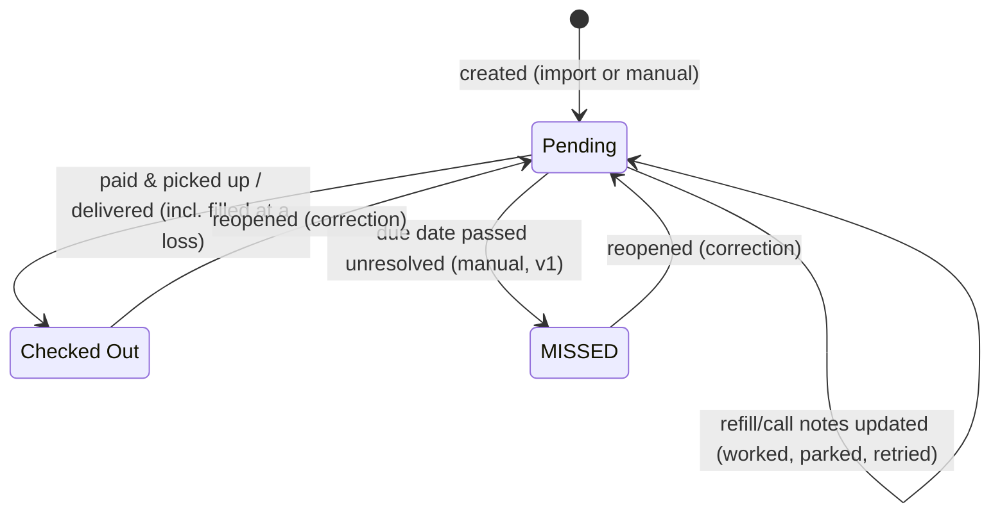

# Refill Tracker — User Flows

Companion to `refill-tracker-design.md` and `user_stories.md`. This document maps how the technician actually moves through the tool. Flows are written as numbered steps with decision branches; Mermaid diagrams are included for the flows where a picture helps. Flow 2 is the heart of the tool — everything else supports it.

A note on reality: the technician works with **two applications side by side** — this tool and PioneerRX. Steps performed *inside Pioneer* are marked `[Pioneer]`. The tool never talks to Pioneer directly; the bridge is the technician's eyes, the clipboard (Rx #), and the CSV export (v2).

---

## Flow 1: App Launch

1. Technician double-clicks the .exe.
2. App opens directly to the **grid view, current calendar month**, sorted by due date ascending. No login, no landing page, no setup wizard.
3. The Opportunities panel loads alongside the grid, already populated for the configured look-ahead window.
4. Branch — current month has no rows:
   - 4a. Grid area shows the empty state: "No refills for July yet" with **Add refill** and (v2) **Import CSV** actions.
   - 4b. Opportunities panel shows its data-horizon hint ("No data beyond <last populated date>").

Success condition: from double-click to "working" is one step and zero decisions.

---

## Grid Interaction Convention

Across Month, Call List, Req Follow Up, and Overdue, grid clicks follow one consistent editing rule:

1. With no dropdown open, one click edits an editable cell. Enter or typing also edits a selected cell; typing into a dropdown selects the first prefix match.
2. From a text/number edit, clicking another editable cell or control commits a valid value (or silently restores an invalid value) and opens or activates the target in that same click.
3. From an open dropdown, the first outside click only commits/restores and closes the dropdown. Nothing underneath receives that click; click again to open or activate the target.
4. Escape restores the original value. Enter and Tab commit/restore and move selection without editing the destination.
5. Invalid input never traps the technician. Destructive call-note clearing still confirms, and a real database-save failure still displays its existing notice.

---

## Flow 2: The Core Loop — Working One Refill

This is the flow the technician repeats dozens of times a day. Entry points: a card in the Opportunities panel (high-value first), or the next unresolved row in the grid (typically filtered to today).

1. Technician picks a row → clicks **Rx #** → copied to clipboard (visual confirmation).
2. `[Pioneer]` Pastes Rx # into PioneerRX search, opens the prescription, runs insurance.
3. **Decision — what did adjudication say?**

   **Branch A: Approved.** Pioneer's window shows copay, drug cost, and net profit.
   - A1. Back in the tool: enter **New Copay** and **New Profit** (cells auto-color; row leaves the Opportunities panel because profit is now verified).
   - A2. **Decision — how to reach the patient?**
     - A2a. **Nimble Link** → set Refill Note = `Nimble Link` → Call Note field unlocks → proceed to Flow 2.1 (contact outcome). From this moment the month grid shows a days-since-sent counter inside the cell; at 5 days it turns red — the cue to re-send the link or switch to a call (design doc §5).
     - A2b. **Phone call** (typically 65+ / not tech-savvy) → set Refill Note = `Call Pt` → Call Note unlocks → Flow 2.1.
   - A3. Once payment/logistics resolve → set **Status = Checked Out**. Row is done.

   **Branch B: Prior authorization required.** Set Refill Note = `PA Req`. Row stays `Pending`; revisited when PA resolves (re-enters this flow at step 2).

   **Branch C: Too early.** Set Refill Note = `TOO SOON TO FILL`. Row stays `Pending`; revisited on/after the allowable date.

   **Branch D: Insurance problem.** Set Refill Note = `INS Issue`. Row stays `Pending` pending resolution.

   **Branch E: No refills remaining.**
   - E1. **Decision — was a fax sent recently?**
     - No → fax the MD office `[outside tool]` → Refill Note = `Faxed for Script`.
     - Yes → Refill Note = `Fax not sent` (duplicate-fax prevention).
   - E2. Row stays `Pending`; when the new script arrives it re-enters at step 2. (Note: a *renewal* may arrive under a **new Rx number** — that becomes a new row; history intentionally does not bridge it. See design doc §5.)

   **Branch F: Patient declines / defers.** Refill Note = `NO Per Pt` (wants verbal authorization; check patient notes) — or the deferral surfaces during contact, handled in Flow 2.1. If therapy is ended outright (patient or prescriber discontinued it) → Refill Note = `Discontinued`; the row resolves — no further fills expected.

   **Branch G: Negative or unacceptable profit.** Technician may still fill (business decision made outside the tool). If filled at a loss: enter the negative New Profit (the profit cell turns red) and check the row out as usual — a loss lives in the money columns, not in status ($ LOSS removed per technician feedback, 2026-07-11).

4. End states for any pass through this flow: the row is either **resolved** (`Checked Out`) or **parked with a reason** (still `Pending`, with a Refill Note explaining why). A row should never be left `Pending` with no note — the grid's "unresolved" filter is the safety net that surfaces these.
5. If the due date passes without resolution → technician sets **Status = MISSED** (v1: manual; a future enhancement may flag overdue `Pending` rows automatically). Overdue `Pending` rows and `MISSED` rows surface automatically in the **Overdue tab** (Flow 8), so slipped work stays visible without hunting through past months.

### Flow 2.1: Contact Outcome (Call Note)

Only reachable when Refill Note is `Nimble Link` or `Call Pt`.

1. **Decision — did you reach the patient?**
   - **Reached, arranges delivery** → `D/S`.
   - **Reached, will pick up** → `P/U`.
   - **Reached, will pay via Nimble later** → `D/S+RSL` (link re-sent).
   - **Reached, wants to hold** → `POH PER PT+WCB` (doesn't want it right now, will call back). Row parks.
   - **Reached, will call back to pay** → `PT WCB+RSL` (Nimble link sent just in case). Row parks.
   - **Reached, prescription no longer wanted/valid** → set *Refill Note* = `Discontinued` (a refill-level state, not a call note). Row resolves (typically no further fill).
   - **Voicemail left** → `LVM+RSL` (link re-sent).
   - **Voicemail full** → `VMB FULL+RSL`.
   - **No voicemail set up** → `VMB NOT SET UP+RSL`.
   - **Couldn't attempt / no answer pathway** → Refill Note may instead be set to `TRY AGAIN LATER`; row parks for retry.
2. Payment confirmation (via Nimble) later updates the Call Note → `Nimble IC` (paid, wants delivery) or `Nimble PickUp` (paid, will pick up).
3. Once picked up / delivered → **Status = Checked Out** (Flow 2, step A3).

---

## Flow 3: Prioritizing by Opportunity

1. Technician opens the app (Flow 1) or returns after a break.
2. Scans the Opportunities panel — cards sorted by last verified profit, descending.
3. Clicks the top card → the corresponding row's detail drawer opens (grid scrolls to the row).
4. Works the refill via Flow 2.
5. Card disappears when New Profit is verified or status leaves `Pending`.
6. Repeats until the panel is empty, then falls back to the grid's "today + unresolved" filter for the remaining (lower-value) rows.
7. If the panel shows the data-horizon hint instead of cards → jump to Flow 5 (import) or continue with the grid; the hint is informational, not blocking.

The intended behavior change vs. the spreadsheet: **highest-value work first, by default**, instead of top-to-bottom row order.

---

## Flow 4: Adding a Refill Manually

1. Click **Add refill** (toolbar, or the empty-state action).
2. Detail drawer opens in create mode. Due date defaults to the currently viewed day (or first of the viewed month).
3. Type drug name → autocomplete against existing drugs.
   - Match selected → drug linked (NDC comes along).
   - No match → "Create new drug" inline (name required, NDC optional — compounds have none).
4. Enter Rx #, insurance, and any known financials.
5. **Duplicate check on save:** Rx # + due date already exists?
   - Yes → warning with two actions: **Open existing row** (abandons the new one) or **Change due date**. Never silently creates a duplicate.
   - No → row saved with `source = manual`, `status = Pending`. Grid updates in place.

---

## Flow 5: Monthly Import (v2)

The month-rollover ritual, replacing "clone the tab."

1. `[Pioneer]` Around month start, technician exports the refill report CSV.
2. In the tool: **Import CSV** (toolbar or empty-month state) → file picker.
3. **Mapping step:** known Pioneer headers arrive pre-mapped (remembered from last time); technician confirms or adjusts. First-ever import: tool proposes mappings by header-name match; technician verifies once. Exports contain whichever columns the technician selected in Pioneer — the wizard maps the known columns present and ignores the rest (only Rx Number is required; a file with no due-date column sends every row to the bulk-date step in 6).
4. **Preview step:** table of parsed rows, each tagged **New** / **Update** (fills blanks only) / **Skip** (no change) / **Probable duplicate** (same Rx # as an existing `Pending` row with a nearby-but-different due date — due dates drift between overlapping exports; technician chooses per row: update the existing row or override and create new) / **Error** (missing Rx #, unparseable date).
5. Technician clicks **Commit**.
6. Result screen: counts per disposition; error rows listed for manual review → each error can be fixed via Flow 4 (manual add) using the displayed raw values. Rows with a blank due date can be **multi-selected** to apply a single due date to all at once — or skipped, individually or in bulk.
7. Rows land in months per their own due dates — a mid-July export containing early-August rows populates both months in one import. No "month setup" exists.
8. Safety property: committing the same file twice → second commit reports "0 new, 0 updated." Re-import is always safe (never touches technician-entered fields).

---

## Flow 6: Investigating One Prescription (History)

1. From grid or an Opportunities card → click row → detail drawer.
2. Drawer top: all editable fields. Drawer bottom: **history for this Rx number** — prior months' rows with dates, copays, profits, notes, status.
3. Typical questions answered here: "What did this pay last time?", "Did we already fax the doctor last month?", "Has this patient been a repeated no-answer?"
4. Clicking a history entry navigates to that row (switching the grid's month if needed); breadcrumb/back returns to the original row.
5. Drawer closes → grid restores scroll position and active filters exactly.

---

## Flow 7: Settings & Data Safety

**7a. Vocabulary change** (new insurance, new secondary coverage, new note type): Settings → relevant list → add/rename/recolor/reorder/deactivate → change reflects immediately in dropdowns; deactivated options persist on historical rows but leave the menus.

**7b. Threshold tuning:** Settings → edit copay tier boundaries or alert X/Y → grid recolors and Opportunities panel recomputes immediately.

**7c. Appearance:** Settings → About → toggle Dark mode → all app-owned surfaces switch immediately. The choice survives restart; business-coded data colors and insurance logos do not change.

**7d. Backup:** Settings → **Back up** → choose folder → timestamped copy of the `.db` file written. Recommended habit: monthly, right after import.

**7e. Restore:** Settings → **Restore** → choose backup file → explicit confirmation ("replaces ALL current data") → app reloads on restored data.

---

## Flow 8: Clearing Overdue Work

1. Technician opens the **Overdue** tab.
2. The list shows, across **all** months: `Pending` rows whose due date has passed, plus `MISSED` rows — oldest first. The current day/month grid is never polluted by these; this tab is their home.
3. Per row, decision — still worth pursuing?
   - Yes → work it via Flow 2 (Rx # copy works here like everywhere else). In v3, an **"add to today's call list"** action pulls the row into the current daily queue instead of working it immediately.
   - No → set **Status = MISSED** (or leave as MISSED). The row remains listed in the tab indefinitely as the permanent record of slipped refills (reopening it returns it to `Pending`).
4. Resolving a row (`Checked Out`) removes it from the tab.

---

## Refill Row State Model

The status field is the coarse lifecycle; notes carry the detail. Legal movements:

Rules of thumb encoded above:
- Terminal states are reachable **only from** `Pending`, and any terminal state can be reopened to `Pending` to correct mistakes (edits are never locked).
- All the workflow nuance (PA pending, too soon, voicemail full, link re-sent…) lives in the **notes**, not in status — status stays a three-value field so "unresolved" filtering stays trivial.

---

## Cross-Flow Invariants

- The clipboard Rx # (Flow 2, step 1) must work from every surface that shows an Rx #: grid (pinned column), Opportunities card, detail drawer, history entries, Overdue tab.
- No flow contains a "Save" step for field edits — persistence is immediate everywhere; explicit confirmation exists only for destructive/irreversible actions (restore, call-note clearing, import commit).
- Every flow that parks a row leaves a note explaining *why* it's parked; the "unresolved" filter is the recurring re-entry point for all parked work.
